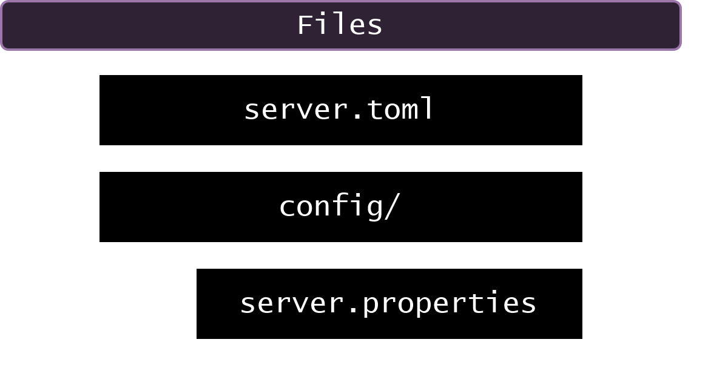

# Getting Started

Let's create a simple server as an example.

## Creating a new server

Create a new folder for your server (or initialize a git repository), open up a terminal inside and run:

```sh
mcman init
```

This command will interactively help you set up a new server in the current directory.


!!! note ":simple-git: Using git"
    `mcman` is fully git-compatible, meaning you can store, share and version control your server using a git repository provider such as [:simple-github: Github](https://github.com).

    This is optional, but **recommended** since you get many benefits such as rollbacks/backups, collaboration, branches, etc.

    When you run `init`, mcman will touch up your `.gitignore` and `.gitattributes`

## Initializing from a modpack

You can check out the [Importing Modpacks](./importing-modpacks.md) section on how to initialize from a modpack.

## What are these files?



After initializing the server, you'll notice a few things:

`server.toml`

:   This file is the core of your server configuration. It contains information about the server type, version, mods, plugins, worlds and more.

the `config/` directory

:   This folder will hold your config files for your Minecraft server, such as `server.properties`

the `server/` directory

:   You might not see this folder immediately after initialization since it will be generated by `mcman` when you **build** the server. Everything, including the `jar` files, will be inside this directory.

    If you are using :simple-git: git, you might notice that this folder is also ignored via `.gitignore`.

## Adding Addons

Lets add a plugin or a mod! For demonstration purposes, lets add *Fabric API from Modrinth (mod)* or *Placeholder API (plugin)*.

### A: Adding via `server.toml`

Add a new entry in your `server.toml`:

```toml
# For Fabric API
[[mods]]
type = "modrinth"
id = "fabric-api"
```

```toml
# For Placeholder API
[[mods]]
type = "spigot"
id = "placeholderapi.6245"
```

### B: Adding via `mcman import`

You can alternatively use the `mcman i url` command:

```sh
mcman import url https://modrinth.com/mod/fabric-api
mcman import url https://www.spigotmc.org/resources/placeholderapi.6245/
```

## How do I run it?

`mcman` is not designed to run your server, but build it.

**Building** is the process where `mcman` sets everything up for you. This includes downloading all the jars, unpacking worlds, processing config files etc. Before you can run the server, it first needs to be built.

Let's build your server using the [`mcman build`](../commands/build.md) command:

```sh
mcman build
```

Then, you can run it using the `start.bat`/`start.sh` [launch scripts](../reference/server-launcher.md) inside the `server/` directory:

=== "Windows"
    ```sh
    cd server
    call start
    ```

=== "Linux"
    ```sh
    cd server
    ./start.sh
    ```

You can alternatively use [`mcman run`](../commands/run.md) to do both of those at once.

## Going Further

Format for addons

:   You can check out the documentation about [Downloadable](../reference/downloadable/index.md)s

Configuration files and the `config/` directory

:   Read on how the `config/` directory works and how you can use it to manage your server's configuration files with ease: [Variables and Bootstrapping](./variables.md)

Developing your server

:   `mcman` includes a **Hot-reloading** feature where your changes to `server.toml`/`config/` are automatically applied. For more information, read [Development Sessions](./dev.md)

More in-depth explanation of Building

:   To learn more about how building works, see [Building, Running and Developing](./building.md)
